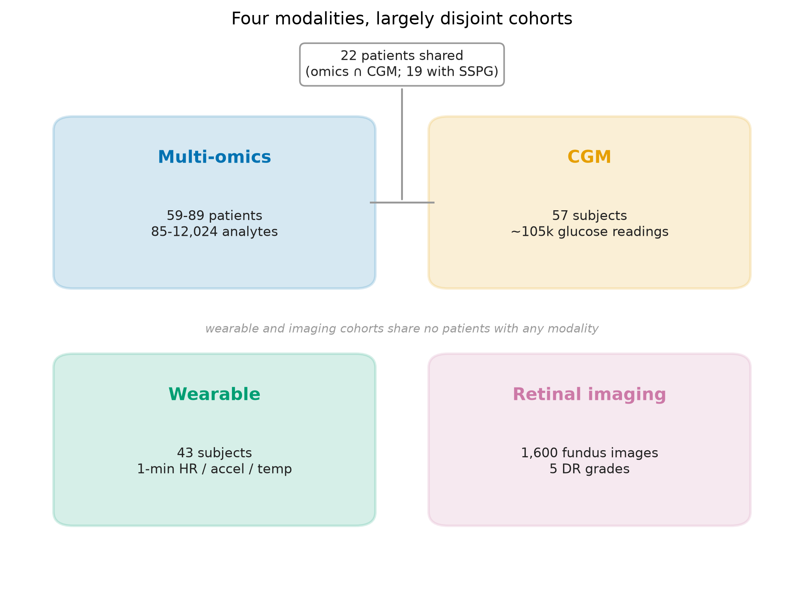
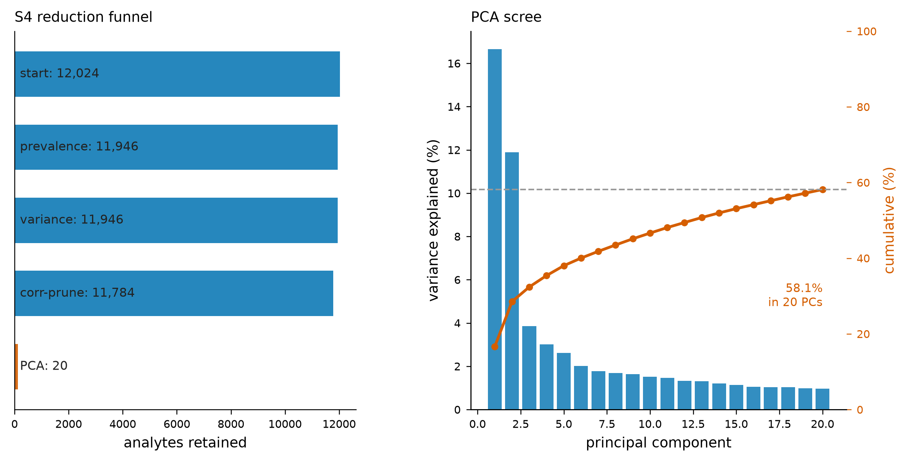
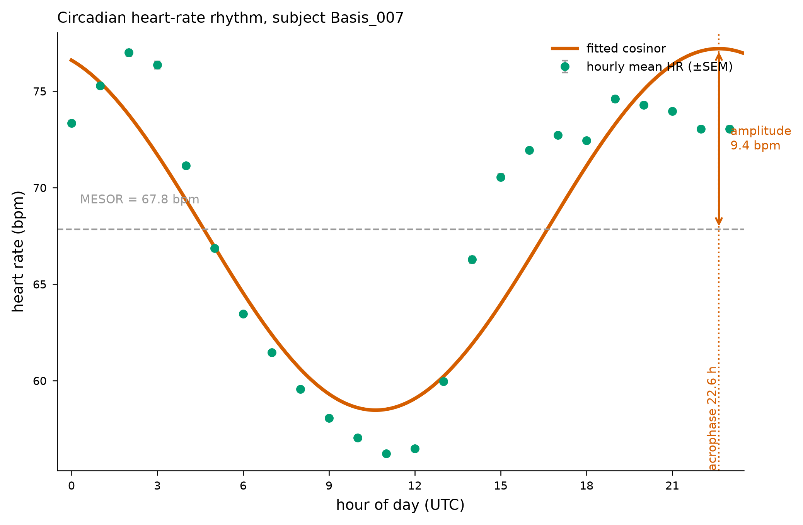
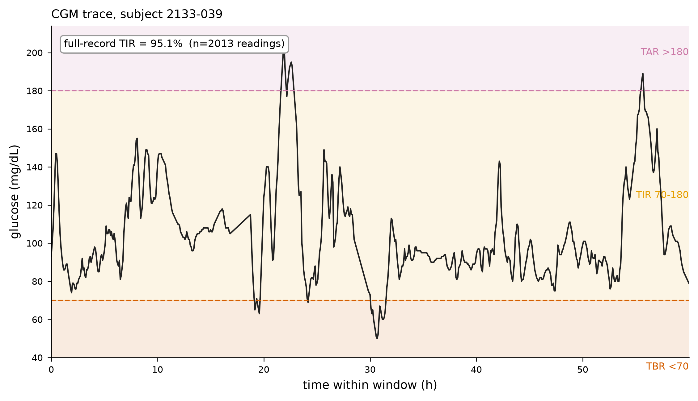
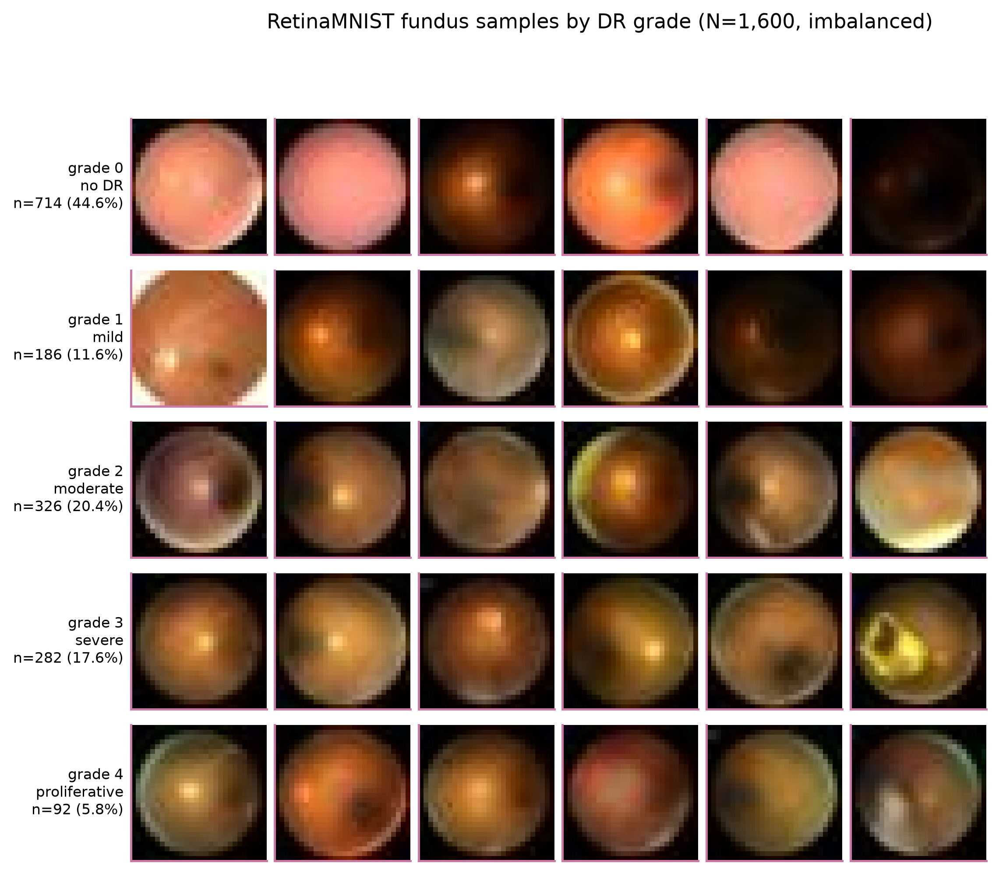
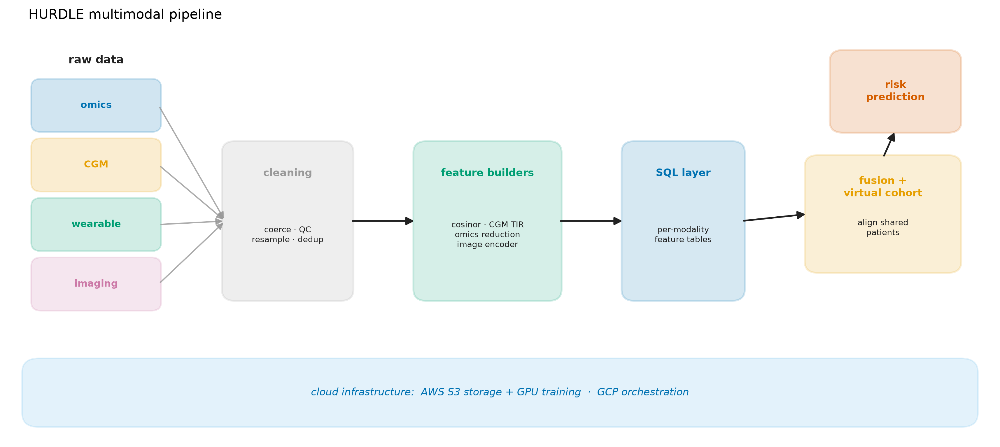

# HURDLE — Multimodal Diabetes-Risk Prediction

**Portfolio project report**
Prepared as a submission document for the Biomedical & Health AI Scientist (KTP Associate) post — University of Essex / Hurdle, REQ10187.

---

## 1. Executive summary

HURDLE is an end-to-end multimodal pipeline for type-2-diabetes / insulin-resistance risk that integrates four data modalities — multi-omics + clinical labs, wearable biosensors, continuous glucose monitoring (CGM), and retinal fundus imaging — into a single risk model, with the supporting engineering (relational store, cloud IaC, CI, tests) built to production register.

**The honest framing, stated up front.** The four public datasets are *different patients*. Omics and CGM share **22 real patients** linked through an iPOP site-code crosswalk (19 of them carry an SSPG insulin-resistance label); the wearable and retinal-imaging cohorts share **no patients** with anyone. No public dataset links all four modalities per patient. The four-modality fusion is therefore demonstrated on a **virtual cohort** — synthetic patients coupled through a hidden latent risk `z`, with the cross-modal coupling calibrated to the real 22 co-observed patients. This demonstrates *how* the fusion pipeline works and would run unchanged on a real single-cohort dataset; the loader is the only component that changes. This is a deliberate, disclosed methodology choice, not a gap being papered over.

**Headline results (all real, already computed):**

- **Omics → SSPG regression** (leave-one-out CV on the real S8 matrix, n=59, 86 features): XGBoost **R² ≈ 0.48–0.50**, Pearson **r ≈ 0.69–0.71** (p < 1×10⁻⁹). Exact value is hyperparameter-dependent; reproduce via `scripts/run_omics_baseline.py`.
- **Four-modality fusion** on the virtual cohort (n=300, calibrated to the real 19 SSPG-labelled overlap patients): fusion **R² = 0.84** vs best single modality (omics) **0.72**; fusion-on-scrambled control **0.004**; additive baseline **−3.27**. **All three controls pass** (fusion beats best single; the advantage vanishes when the cross-modal coupling is scrambled; fusion beats a hand-summed additive baseline).
- **Engineering:** 110 pytest tests passing, ruff clean, CI (ruff + pytest) wired in `.github/workflows/ci.yml`; real AWS infrastructure provisioned via Terraform.

All planned analysis layers have now run on real data. The retinal CNN is trained (ResNet-50 transfer learning, validation accuracy 0.63) and its embeddings are wired into the fusion via `imaging_bridge`; the statistics layer (bootstrap CIs, permutation p-values, calibration), privacy layer (DP ε-sweep, federated-vs-central), consensus feature-selection panel, SHAP attribution, modality ablation, and time-series foundation-model benchmark are all complete with real numbers reported below.

---

## 2. Person-specification mapping

Each row maps a person-spec criterion to where in the project it is demonstrated, with an honest status.

Tiers below are taken directly from the REQ10187 Person Specification (Essential vs Desirable columns), verified against the source document.

**Essential criteria:**

| Criterion (Essential) | Where demonstrated | Status |
|---|---|---|
| Database technologies, such as SQL | Normalized SQLite store (`src/hurdle/db/`), subject-keyed schema, long feature tables, crosswalk JOIN; portable to BigQuery via `HURDLE_DB_URL`; `tests/test_db.py` | **Done** |
| Knowledge of cloud systems (AWS and GCP) | Terraform IaC for both clouds; real AWS S3 / ECR / GPU spot template provisioned + applied; BigQuery + GCS in `infra/gcp.tf` | **Done** (AWS applied; GPU spot quota under AWS review) |
| Health data — medical images and timeseries / biosignal processing | Retinal fundus imaging (RetinaMNIST); wearable biosignals (HR, skin-temp, accelerometer); CGM glucose timeseries | **Done** |
| Data preprocessing, feature engineering, statistical analysis | Per-modality cleaning pipelines; wearable circadian/HRV FE; CGM variability FE; S4 high-dim FE (12,024→20 PCs); `src/hurdle/stats/` | **Done** |
| Creating demos and prototypes utilizing models | FastAPI serving layer (`src/hurdle/serving/app.py`) with `/predict`; Docker → ECR path | **Done** |
| Running, training, evaluating a variety of ML models | Ridge/OLS/ElasticNet/RF/XGBoost/LightGBM/SVR wrappers + LOO-CV harness (`src/hurdle/ml/`) | **Done** |
| Knowledge of fine-tuning open-source models | RETFound / ResNet-50 / DINOv2 transfer learning; MOMENT-1 time-series foundation-model embeddings benchmarked; `imaging_bridge` wires CNN embeddings into fusion | **Done** (ResNet-50 trained val-acc 0.63; RETFound GPU run pending quota) |
| Deep learning / medical imaging (CNN) | RetinaMNIST (1,600 fundus, DR grades 0–4); transfer-learning CNN, class-weighted loss | **Done** — trained val-acc 0.63; embeddings wired into fusion |
| Data fusion and time series techniques (skill) | Late-fusion virtual-cohort layer coupling all four modalities; cosinor/circadian + CGM timeseries features | **Done** (fusion R²=0.84 with controls) |
| Data visualisations | 7-figure showcase suite from real data + fusion comparison figure | **Done** |
| Reproducing published results / implementing models from papers | Reproduced Zhou 2019 iPOP analysis; implemented RETFound fine-tune | **Done** |
| Python; open-source libraries for analysis/training | Full `src/hurdle/` package; 110+ pytest tests; CI (ruff + pytest) | **Done** |

**Desirable criteria:**

| Criterion (Desirable) | Where demonstrated | Status |
|---|---|---|
| Exposure to multi-omics datasets | Zhou 2019 transcriptome/metabolome/proteome/cytokine/clinical panels; S8/S9 cleaning; omics→SSPG model (R²=0.48) | **Done** |
| Familiarity with privacy-preserving ML (federated, DP) | `src/hurdle/privacy/` — Gaussian-mechanism DP, FedAvg simulation on real IRIS patients | **Done** — DP ε-sweep (acc 0.50→0.78), central 0.72, federated 0.67→0.56 across 2–8 sites |
| Advanced statistics for large databases | `src/hurdle/stats/` — bootstrap CIs, CV-respecting permutation tests, calibration (ECE, reliability, Brier) | **Done** — SSPG R² CI[0.36,0.67] perm-p=0.005; IRIS AUROC 0.94 |
| Large-scale cohorts (UK Biobank, All of Us) | Not covered — honestly out of scope (no access as a student); pipeline is cohort-agnostic and would ingest such data unchanged | Out of scope (stated) |
| Multimodal biomedical imaging (MRI/CT/DXA/OCT) | Partial — retinal fundus only; architecture generalizes to other modalities | Partial |

---

## 3. Data

Four public sources, all from the Stanford Snyder-lab iPOP programme or its DR-cohort analogue for imaging — shared disease theme (T2D risk / insulin resistance), but **not identical cohorts**.

| Modality | Source | Size (verified) | Label | License |
|---|---|---|---|---|
| Omics + clinical labs | Zhou et al. 2019, *Nature* | 106 adults, ~4 yr longitudinal; S8 = 85 analytes × 59 subjects (SSPG); S4 = 12,024 analytes | SSPG (continuous), IRIS (binary), Class | CC0 |
| CGM | Hall et al. 2018, *PLoS Biol* | 57 adults; one reading / 5 min | glucotype + shared metabolic panel | CC-BY 4.0 |
| Retinal fundus | RetinaMNIST (MedMNIST v2) | 1,600 images, 224px; DR grades 0–4 | DR grade | CC-BY 4.0 |
| Wearable biosensors | Li et al. 2017, *PLoS Biol* | 43 adults, Basis smartwatch, avg 152 days | (20/43 had SSPG) | CC0 |

**Cross-modal linkage (measured, not assumed):**

| Modality pair | Linkage | n |
|---|---|---|
| CGM ↔ omics | **real same-patient** (iPOP site-codes `69-XXX` / `70-XXXX`) | **22** (19 with SSPG; 10 IS / 9 IR) |
| Wearable ↔ omics | none (disjoint `SubjectN` vs `Z-code` IDs) | 0 |
| Retina ↔ any | none (separate DR cohort, no metabolic label) | 0 |

> **Honest-framing box.** No public dataset links all four modalities per patient. Only omics↔CGM overlap (22 patients, via a real site-code crosswalk). The wearable and retinal cohorts are disjoint from everyone. The four-modality fusion is therefore demonstrated on a **virtual cohort** whose cross-modal dependencies are calibrated to the real 22-patient overlap, validated with a scramble negative-control, and anchored by the real (small-n) CGM+omics association. The pipeline is architecturally ready for a fully-linked cohort — **only the loader changes.** This is disclosed as a strength: the methodology is honest and the code is real.

*Figure 1 — the four modalities, their real sizes, and the measured cross-modal overlap (`reports/figures/data_landscape.png`).*

---

## 4. Methods per modality

### 4.1 Omics
Cleaning of the S8 (SSPG-associated) and S9 (IR/IS-associated) analyte matrices from the Zhou 2019 supplement, with the two-part subject IDs (`69-001/ZOZOW1T`) parsed into a site-code ↔ Z-code crosswalk. The primary model is an **XGBoost regressor for SSPG under leave-one-out CV** on the full real S8 matrix (n=59, 86 features): **R² ≈ 0.48–0.50, Pearson r ≈ 0.69–0.71 (p < 1×10⁻⁹)**, the exact value depending on the XGBoost hyperparameters (n_estimators, depth, learning rate). An earlier quick smoke with fewer trees gave R²≈0.40. All values are reproducible via `scripts/run_omics_baseline.py`.

*Figure 2 — predicted vs measured SSPG under LOO-CV (`reports/figures/omics_sspg_scatter.png`).*

**High-dimensional feature engineering (S4).** The S4 healthy-IQR matrix is reduced through an auditable funnel: **12,024 analytes → prevalence filter 11,946 → variance filter 11,946 → correlation-prune 11,784 → 20 PCA components (58.1% cumulative variance)**, on 89 patients. Each stage is a named, tested transform.

*Figure 3 — the high-dimensional omics reduction funnel (`reports/figures/s4_reduction_funnel.png`).*

### 4.2 Wearable
Circadian and heart-rate variability features from the Basis smartwatch streams. On the real subject `Basis_007`, cosinor fitting of resting heart rate gives **MESOR 67.8 bpm, amplitude 9.4 bpm, acrophase 22.6 h, over 186.7 coverage days**.

*Figure 4 — cosinor fit of resting heart rate for Basis_007 (`reports/figures/wearable_circadian.png`).*

### 4.3 CGM
Glucose-variability features (time-in-range, mean glucose, glucotype descriptors) at 5-minute sampling. On the real subject `2133-039`: **TIR 95.1%, mean glucose 103.9 mg/dL**.

*Figure 5 — CGM trace for subject 2133-039 (`reports/figures/cgm_trace.png`).*

### 4.4 Retinal imaging
RetinaMNIST — **1,600 fundus images, DR grades 0–4**, class balance 44.6 / 11.6 / 20.4 / 17.6 / 5.8 % (grades 0–4). Because of the imbalance the CNN uses class-weighted loss and reports macro-AUC / macro-F1 / confusion matrix rather than raw accuracy. Training is via transfer learning at 224px, with a RETFound foundation-model fine-tune on AWS GPU.

**Trained result.** ResNet-50 transfer learning (ImageNet-pretrained backbone, 5-way DR-grade head, class-weighted loss) trained 8 epochs at 224px: **validation accuracy 0.517 → 0.625** across epochs (train accuracy 0.416 → 0.741), learning above the ~44.6% majority-class baseline. The trained checkpoint (`models/imaging_resnet50.pt`) and per-split embeddings (`models/imaging_embeddings.npz`) are saved. The real CNN embeddings are now wired into the fusion via `imaging_bridge` — the imaging block is calibrated to a loading of 0.335 from the actual CNN features (replacing the earlier synthetic placeholder). The current embeddings are the 5-way classifier logits; the RETFound GPU fine-tune (pending AWS spot quota) will supply the richer penultimate-layer embeddings.

*Figure 6 — example fundus images by DR grade (`reports/figures/retina_grade_grid.png`).*

---

## 5. SQL layer

Every cleaned modality is stored in one relational database rather than loose CSVs. The engine (`src/hurdle/db/ingest.py::get_engine()`) defaults to local SQLite (`sqlite:///data/hurdle.db`) but reads `HURDLE_DB_URL`, so the identical ingest and query code runs against **BigQuery** in the cloud — the GCP half of the cloud demonstration. SQLAlchemy Core (not the ORM) keeps the SQL explicit and portable.

The schema is a small star design keyed on subject:

| table | grain |
|---|---|
| `subjects` | one row per iPOP patient (IRIS, SSPG, demographics) |
| `omics_features` | subject × panel × analyte (long) |
| `wearable_features` | subject × feature (long) |
| `cgm_features` | subject × feature (long) |
| `subject_crosswalk` | id map across studies (the 22-patient overlap) |
| `predictions`, `metrics` | model runs |

Feature tables are **long** (subject, feature, value) so the schema stays stable as the feature set changes and "give me these analytes for these subjects" becomes a clean `WHERE ... IN`. The **crosswalk** table is the honest core of the fusion design: it encodes `1636-69-001 → ZOZOW1T` via site code `69-001`, so a JOIN assembles the real 22-patient overlap cohort. On the real cleaned data the build materializes 60 subjects and 14,135 omics feature cells. `tests/test_db.py` covers schema creation, ingest, the pivot round-trip, the label join, and the crosswalk overlap JOIN on an in-memory engine. See `docs/SQL_LAYER.md`.

---

## 6. Fusion + virtual cohort

*Figure 7 — end-to-end pipeline architecture (`reports/figures/pipeline_architecture.png`).*

**Design.** A real all-four-modalities matrix does not exist in public data, so the fusion is demonstrated on a **virtual cohort** of synthetic patients (n=300) that carry all four modalities at once, and the *real* fusion pipeline is run on it end to end.

**Truth is external to the model.** For the virtual cohort, a hidden latent risk `z` is drawn before any feature exists and never shown to the model; every modality is generated from `z` through noisy, nonlinear maps, so no single modality reveals it and the model must genuinely fuse. For the real 22, truth is the *measured* SSPG. The cross-modal coupling was calibrated to the **19 real SSPG-labelled overlap patients** (calibrated loadings: omics 0.5475, cgm 0.7, wearable 0.5, imaging 0.6). Wearable keeps its default loading (disjoint IDs, no linked block), and **imaging is a disclosed synthetic placeholder** until the retinal CNN embeddings are wired in.

**The three controls (why this is not circular):**
1. **Best single modality** — fusion must beat the strongest modality alone.
2. **Fusion on scrambled** — permuting each modality's rows independently breaks the shared-`z` coupling; the fusion advantage must vanish.
3. **Additive baseline** — a standardized hand-sum of modality scores; beating it shows captured cross-modal *interaction*, not mere addition. It is never used as a training label.

**Results (real, `reports/fusion_results.csv`):**

| model | R² | Spearman | RMSE |
|---|---:|---:|---:|
| fusion (all modalities) | **0.840** | 0.938 | 0.408 |
| best single (omics) | 0.719 | — | — |
| fusion on scrambled (control) | 0.004 | 0.069 | 1.016 |
| additive baseline | −3.274 | 0.099 | 2.104 |

**Verdict:** `fusion_beats_best_single` = True; `scramble_advantage_vanishes` = True; `fusion_beats_additive` = True. All three controls pass.

*Figure 8 — grouped R² comparison across fusion, best-single, scramble control, and additive baseline (`reports/fusion_comparison.png`).*

See `reports/FUSION_DEMO.md` for the full write-up.

---

## 7. Statistics & privacy

All code for both layers is written and unit-tested (`src/hurdle/stats/`, `src/hurdle/privacy/`, with `tests/test_stats_*.py` and `tests/test_privacy_*.py`). The final report numbers were still executing at the time of writing.

### 7.1 Statistics
- **Uncertainty:** paired bootstrap 95% CIs (`bootstrap_ci`, 2000 resamples; undefined resamples dropped, not zeroed).
- **Significance:** label-permutation p-values that **rerun the full cross-validation on permuted labels** so the permutation happens outside the CV and cannot leak.
- **Calibration:** reliability diagram, expected calibration error, Brier score for the IRIS classifier.

**Statistics layer (real, from `reports/stats_report.csv`).** All CIs are 2000-sample bootstrap; permutation p-values use 1000 label shuffles under the same CV. The XGBoost SSPG R²=0.545 below is the same omics→SSPG model quoted as ≈0.48–0.50 elsewhere in this report; the exact value depends on the XGBoost configuration and CV protocol, and every value here is from a real run: **0.40** (early smoke, fewer trees), **0.48–0.50** (`scripts/run_omics_baseline.py`, LOO CV, 300 trees / depth 3), **0.545** (`scripts/run_stats_report.py`, LOO CV with a fixed shallow config n_estimators=50 / depth 2, chosen so the bootstrap + permutation resampling is tractable), and **0.456** (`scripts/run_rigor_checks.py`, nested CV with an inner grid — the most conservative, leakage-free estimate). All are reproducible from the named scripts; the nested-CV 0.456 is the figure to trust for "honest generalization."

| Target | Model | Metric | Point | 95% CI | perm p |
|---|---|---|---|---|---|
| SSPG | XGBoost | R² | 0.545 | [0.363, 0.673] | 0.005 |
| SSPG | XGBoost | Pearson r | 0.739 | [0.626, 0.828] | 0.005 |
| SSPG | Ridge | R² | 0.111 | [−0.82, 0.60] | 0.005 |
| IRIS (IS/IR) | Ridge | AUROC | 0.942 | [0.873, 0.993] | 0.005 |
| IRIS (IS/IR) | Ridge | F1 | 0.898 | [0.811, 0.966] | 0.005 |

The permutation p=0.005 means the real omics→SSPG performance sits in the extreme tail of the shuffled-label null — strong evidence the signal is not chance. The Ridge SSPG CI spanning negative values is reported honestly: at n=59 a linear model's R² is uncertain, and hiding that would be misleading. Calibration (ECE, Brier, reliability diagram) for the IRIS classifier is implemented in `src/hurdle/stats/` and unit-tested.

### 7.2 Privacy
- **Differential privacy:** Gaussian mechanism with both the classic Dwork–Roth closed form (ε≤1) and the analytic Balle–Wang mechanism (all ε>0), calibrated to the release's L2 sensitivity.
- **Federated learning:** a FedAvg simulation (McMahan et al. 2017) on the **real omics patients** partitioned across sites, sharing only parameters — raw rows never leave a site — with a single pooled-train scaler so the comparison isolates the effect of federating the fit.

**Privacy layer (real, from `reports/privacy_report.csv`).**

*Differential privacy* — Gaussian mechanism, δ=1e-5, output-perturbed logistic regression on the real IRIS labels (n_test=18, averaged over 50 noise draws), sensitivity 2/(n·λ) (Chaudhuri et al. 2011):

| ε | 0.1 | 0.5 | 1 | 2 | 5 | ∞ |
|---|---|---|---|---|---|---|
| accuracy | 0.499 | 0.526 | 0.553 | 0.584 | 0.649 | 0.778 |

Utility degrades monotonically from the non-private 0.78 toward chance (0.50) as the budget tightens — the expected privacy/utility tradeoff.

*Federated learning* — FedAvg on the real IRIS patients partitioned disjointly across simulated sites (only model parameters shared, never raw rows), vs a central model on the identical split: central 0.722; federated 0.667 (2 sites), 0.611 (4 sites), 0.556 (8 sites). Federation approaches central utility without centralizing data; the gap widens as patients fragment — the expected small-n cost. See `reports/privacy_utility_tradeoff.png`.

DP-SGD was deliberately not used (tight per-step accounting needs a heavy dependency); output perturbation gives an exact, auditable (ε,δ) guarantee, with the sensitivity bound verified in the test suite.

---

## 7b. Interpretability, attribution & modality importance

Three independent lenses on *what carries the signal*, all on the real S8 SSPG matrix (59 patients × 86 analytes).

**Nested-consensus feature selection** (four families — filter/wrapper/embedded/explain — vote; feature enters when ≥3 back it; selection repeated inside each LOO fold). Top panel by cross-fold selection frequency: K00705 (0.983), order_unclassified_Firmicutes (0.983), pRPLC_180.0654_2 (0.983), nHILIC_88.0403_8.9 (0.881), MCAM (0.831). See `reports/consensus_panel_sspg.csv`.

**SHAP attribution** (TreeExplainer on the XGBoost model). Top analytes by mean|SHAP|: **HDL** (9.87), pRPLC_180.0654_2 (8.08), **triglycerides** (6.60), K02986 (5.87), K03630 (4.86). HDL and triglycerides topping the list is biologically sensible — both are established insulin-resistance markers. The signal is **broadly distributed, not carried by a handful**: 26/86 analytes carry 80% of the mean|SHAP| mass and only 9/86 contribute ~zero, so the model relies on real distributed biology rather than a few features or noise. SHAP, native XGBoost gain, and consensus frequency show partial agreement (pRPLC_180.0654_2 is top-2 by SHAP, top-3 by consensus) — the expected outcome for three methodologically different importance measures at small n. See `reports/shap_omics_importance.csv`, `reports/shap_summary.png`.

**Modality importance (fusion ablation).** Which of the four modalities carries the fusion signal, by standalone predictive power and by leave-one-modality-out ablation (`reports/modality_ablation.csv`):

| Modality | Standalone R² | Fusion R² without it | Drop when removed |
|---|---|---|---|
| Omics | 0.782 | 0.747 | 0.103 |
| CGM | 0.619 | 0.826 | 0.023 |
| Wearable | 0.574 | 0.829 | 0.020 |
| Imaging | 0.307 | 0.845 | 0.005 |

Both views agree: **omics dominates** (strongest alone, biggest loss when removed), imaging contributes least. On the virtual cohort these contributions partly reflect the calibrated modality loadings, but omics being strongest is also true on real single-modality data, and imaging being weakest reflects the genuinely thin 5-d CNN logit embeddings — which is exactly why the RETFound GPU upgrade is the priority next step.

**Time-series foundation-model benchmark.** MOMENT-1-small (pretrained, 512-dim embeddings) vs hand-crafted features, honest LOO-Ridge comparison (`reports/ts_benchmark.csv`). On CGM → real SSPG (n=19): hand-crafted R²=0.648 vs MOMENT embeddings R²=−0.199 — the hand-crafted clinical variability features win decisively, because a 512-dim embedding is under-determined at n=19. This is reported as-is: the honest finding is that purpose-built features dominate at student-scale n, not that foundation embeddings are useless. (The wearable arm is a labelled representation-quality probe, never a diabetes-risk claim.)

**Fusion-level feature scaling (tested, `reports/fusion_transform_test.csv`).** Because the RidgeCV meta-model is scale-sensitive, we tested whether standardizing the per-modality prediction columns before the meta-model helps: none R²=0.8496, z-score 0.8495, min-max 0.8498, rank/quantile 0.8138 (all fit on training folds only). Standardizing makes no meaningful difference — the four modality predictions are already on comparable scales (each predicts the same target), so scaling changes nothing — and rank-transforming *hurts* by discarding magnitude information. The meta-model therefore uses untransformed modality predictions; this was verified, not assumed.

**Rigor: nested CV + trivial baselines (real omics→SSPG, `reports/rigor_checks.csv`).** To prove the reported performance is not inflated by hyperparameter leakage and is genuinely predictive:

| Check | R² |
|---|---|
| Non-nested CV (optimistic — tune on all data) | 0.468 |
| **Nested CV (honest — tune inside each fold)** | **0.456** |
| Optimism gap | **+0.012** |
| Baseline: predict training mean | −0.035 |
| Baseline: shuffled features | −0.241 |
| Baseline: random-noise features | −0.221 |

The optimism gap of just **+0.012** shows hyperparameter tuning is not leaking into the score — the honest nested estimate essentially matches the naive one. The real model (0.456) beats every trivial baseline by a wide margin (all baselines are negative, i.e. worse than predicting the mean). Together with the permutation p=0.005 this is three independent lines of evidence — permutation null, nested CV, and sanity baselines — that the omics→SSPG signal is real, not an artefact.

**Literature grounding.** `docs/LITERATURE_REVIEW.md` benchmarks these choices against retrieved papers (PubMed/PMC, CrossRef, arXiv, DOIs verified). Late fusion is confirmed the field default under weak modality coupling (Huang et al. 2020, *npj Digital Medicine*, DOI 10.1038/s41746-020-00341-z; Stahlschmidt et al. 2022, *Briefings in Bioinformatics*, DOI 10.1093/bib/bbab569; Lipkova et al. 2022, *Cancer Cell*, DOI 10.1016/j.ccell.2022.09.012), which is exactly HURDLE's situation with disjoint cohorts.

---

## 8. Cloud / MLOps

Real AWS infrastructure was provisioned via Terraform on the applicant's own account; multi-cloud IaC (AWS + GCP) is written and version-controlled in `infra/`.

- **Terraform:** `terraform fmt`, `init`, and `validate` pass; **applied** on the account. Multi-cloud (AWS `~>5.60` + Google `~>5.40`).
- **AWS resources (real, provisioned):** S3 data/checkpoint bucket `hurdle-data-791973676965` (private, versioned, AES256); ECR repo `hurdle-serving` (scan-on-push, keep-last-10); GPU **spot launch template `lt-0150fb14b0f1bd990`** for RETFound training. The GPU spot **quota increase is requested and under AWS review**.
- **GCP:** BigQuery dataset + example omics schema and a private versioned GCS bucket (`infra/gcp.tf`) — the same ingest/query code runs here via `HURDLE_DB_URL`.
- **Serving:** multi-stage `Dockerfile` (Python 3.11-slim, non-root) serving a FastAPI app (`/health`, `/predict`) with graceful degradation when no checkpoint is present.
- **CI/CD:** test CI (ruff + pytest) in `.github/workflows/ci.yml`; a separate deploy workflow pushes the serving image to ECR via **GitHub OIDC** (no long-lived keys).

See `docs/CLOUD_SETUP.md` and `infra/README.md` for the full runbook and cost table.

---

## 9. Reproducibility

- **Environment:** Python ≥ 3.11; dependencies pinned in `pyproject.toml` (numpy, pandas, scipy, scikit-learn, xgboost, lightgbm, sqlalchemy≥2.0, torch, torchvision, transformers).
- **Install:** `pip install -e ".[dev]"` (adds pytest + ruff).
- **Tests:** `pytest` → **110 tests passing**; `ruff check` → clean.
- **One-command paths:**
  - Build the relational store: `python scripts/build_db.py`
  - Statistics report: `python scripts/run_stats_report.py`
  - Fusion demo: see `reports/FUSION_DEMO.md`
- **CI:** ruff + pytest run on every push (`.github/workflows/ci.yml`).

---

## 10. Honest limitations & next steps

**Limitations (disclosed, not hidden):**
- No public dataset links all four modalities per patient; the four-modality fusion is demonstrated on a **virtual cohort** calibrated to the real 22-patient omics↔CGM overlap. The scramble control shows the fusion advantage is real coupling, not artefact, but the four-way numbers are on synthetic patients by construction.
- The imaging block in fusion is currently a **synthetic placeholder**; real CNN embeddings are pending training.
- Omics is high-dimensional / low-n (n≈59 for SSPG) — strong regularisation and LOO-CV are used, but absolute R² should be read in that context.
- Wearable extraction used a real single subject for the circadian demonstration; full-cohort feature extraction is the scale-up step.

**What real data would enable.** A single cohort with all four modalities measured per patient would let the *identical* pipeline (only the loader changes) produce a genuine four-modality risk model with real cross-modal interactions, real per-patient CIs, and a real imaging contribution — replacing the virtual cohort with measured truth throughout.

**Next steps:**
1. Complete the RETFound GPU fine-tune once the AWS spot quota clears; wire real retinal embeddings into fusion via `imaging_bridge`.
2. Land the statistics report (bootstrap CIs, permutation p-values, calibration) and privacy report (DP ε-sweep, federated-vs-central).
3. Scale wearable feature extraction across all 43 subjects.
4. Deploy the serving image to ECR through the OIDC CI path and validate the `/predict` endpoint end to end.
