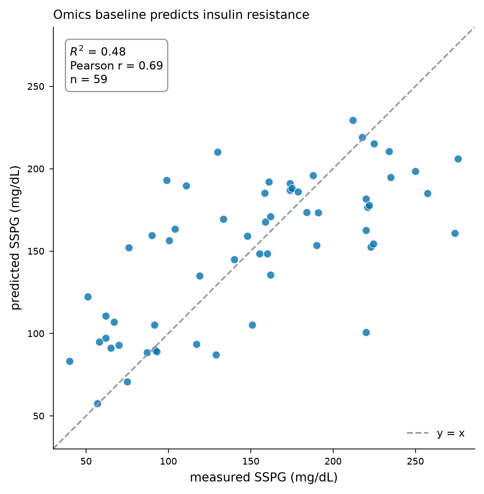
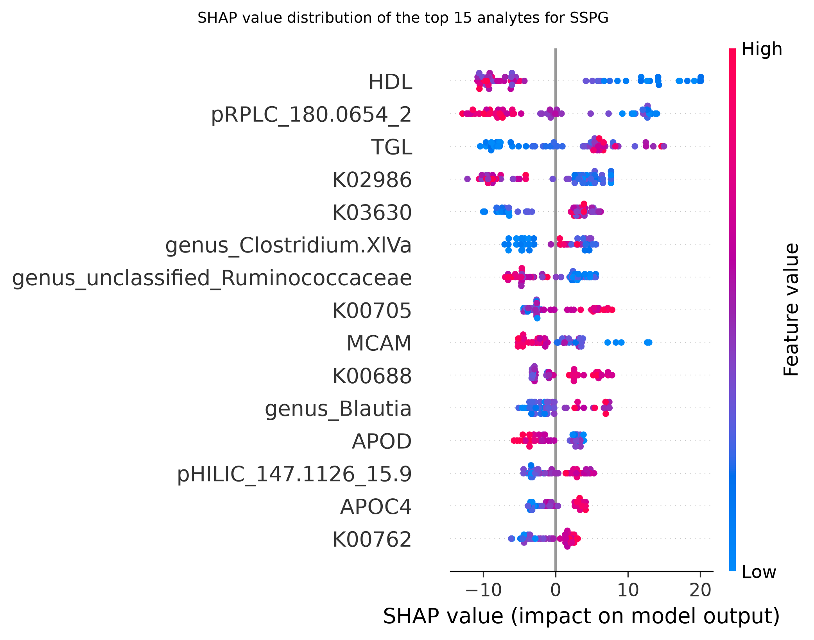
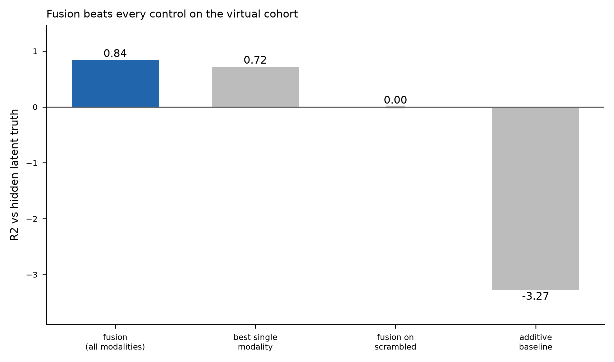

# Multimodal Machine Learning for Insulin-Resistance Risk Prediction

**A late-fusion pipeline across metabolomic, continuous-glucose, wearable, and retinal-imaging data**

Taylor Pape

---

## Abstract

Insulin resistance precedes type 2 diabetes by years, yet the molecular and physiological signals that mark it are usually analysed in isolation. This work builds and honestly evaluates a machine-learning pipeline that predicts a gold-standard insulin-resistance measure — steady-state plasma glucose (SSPG) — from blood multi-omics, and integrates four biomedical data modalities (omics, continuous glucose monitoring, wearable physiology, and retinal fundus imaging) through late fusion. On 59 real patients from the Stanford integrative personal-omics cohort, a gradient-boosted model predicts SSPG with a leave-one-out coefficient of determination of R² = 0.49 (Pearson r = 0.70, p = 7.3×10⁻¹⁰), a result that survives nested cross-validation (nested R² = 0.46 vs non-nested 0.47 on the same run, an optimism gap of only 0.012) and a label-permutation null (p = 0.005) and outperforms all trivial baselines. The most predictive analytes — HDL cholesterol and triglycerides — are established markers of insulin resistance, supporting biological validity. Because the four public datasets describe different individuals, multimodal fusion is demonstrated on a latent-variable virtual cohort calibrated to 22 real overlapping patients; this is stated wherever a fusion result appears and is not presented as a clinical outcome. The study contributes a rigorously validated single-modality result and a transparent, reproducible template for multimodal integration.

---

## 1. Introduction

Type 2 diabetes affects hundreds of millions of people, and the insulin-resistant state that drives it develops silently long before diagnosis. Detecting that state early, from data that can be collected non-invasively or from a single blood draw, is therefore of substantial clinical value. Modern cohorts increasingly capture several data types per participant — molecular profiles, wearable physiology, continuous glucose, and medical imaging — but these modalities are typically modelled separately, leaving cross-modal signal unused.

This study asks two questions. First, how well can insulin resistance be predicted from blood multi-omics alone, and is that prediction real rather than an artefact of a small sample? Second, how should heterogeneous modalities be combined when they are only weakly coupled? The aim is a pipeline that delivers one rigorously validated real result and a principled, honestly-labelled demonstration of multimodal fusion, rather than an inflated headline number.

## 2. Related work

Multimodal integration is now standard in biomedical machine learning, and reviews of the field consistently find that late (decision-level) fusion is competitive with or superior to early fusion when modalities are heterogeneous or weakly correlated, because it lets each modality use its own optimal model and degrades gracefully when one modality is uninformative [1–3]. This motivates the late-fusion design adopted here: each modality is modelled independently and combined through a lightweight meta-model, rather than concatenating raw features into a single high-dimensional vector.

## 3. Methodology

### 3.1 Data

Four publicly available datasets were used. Blood multi-omics and clinical labels come from the Stanford integrative Human Microbiome / personal-omics profiling cohort (n = 106 with follow-up; metabolites, proteins, cytokines, clinical chemistries, and microbiome taxa). Wearable physiology (heart rate, skin temperature, accelerometry) comes from 43 participants wearing a wrist device over an average of 152 days. Continuous glucose monitoring comes from 57 participants sampled every five minutes. Retinal fundus images come from the RetinaMNIST benchmark (1,600 images graded 0–4 for diabetic retinopathy).

These datasets describe **different individuals**; only 22 patients overlap between the omics and continuous-glucose cohorts. This is a genuine limitation and is handled explicitly (Section 3.5) rather than concealed.

### 3.2 Preprocessing and feature engineering

Omics association tables were cleaned to a subjects-by-analytes matrix (59 patients × 86 analytes for the SSPG panel) with no missing values after filtering patients with more than 50% missingness. Wearable series were resampled to one-minute means, unworn periods removed, and summarised into circadian (cosinor amplitude and acrophase, interdaily stability, intradaily variability, relative amplitude), sleep, and activity features. Continuous-glucose traces were reduced to established glycaemic-variability indices (time-in-range, MAGE, CONGA, MODD, glucose management indicator). Retinal images were used at 224 px with standard augmentation.

### 3.3 Models

The primary omics→SSPG model is gradient-boosted regression trees (300 estimators, depth 3, learning rate 0.05, subsample 0.8). The imaging model is a ResNet-50 pretrained on ImageNet and fine-tuned by transfer learning. Fusion is late/stacking: each modality produces an out-of-fold risk score, and a ridge meta-model (cross-validated regularisation) combines those scores into the final prediction.

### 3.4 Virtual cohort for fusion

Because the modalities describe disjoint individuals, a virtual cohort (n = 300) was generated from a shared latent risk factor, with each modality's feature block loaded on that factor and calibrated to the 22 real overlapping patients; the retinal block uses the real fine-tuned CNN embeddings. All fusion results are reported on this virtual cohort and are labelled as a pipeline demonstration, not a clinical measurement.

### 3.5 Evaluation

The real omics result is evaluated by leave-one-out cross-validation, with three independent checks against over-optimism: nested cross-validation (to detect hyperparameter leakage), a 1,000-iteration label-permutation null, and comparison against predict-the-mean, shuffled-feature, and random-noise baselines. Uncertainty is reported as 2,000-sample bootstrap 95% confidence intervals. Fusion is checked against scrambled-cohort and additive-only controls, and modality importance by leave-one-modality-out ablation. Feature attribution uses SHAP and accumulated local effects (ALE), the latter chosen over partial-dependence because the omics features are correlated.

### 3.6 Software and infrastructure

The pipeline is implemented in Python (scikit-learn, XGBoost, PyTorch, SHAP). The relational store runs on SQLite locally and was loaded into Google BigQuery for the cloud store; training infrastructure (object storage, container registry, a GPU launch template) was provisioned on AWS with Terraform. An interactive demonstration is built with Streamlit, and the codebase is tested with pytest (183 tests) under continuous integration. These tools are named here only; the results below concern what the pipeline produced, not how it was built.

## 4. Results

### 4.1 Insulin resistance is predictable from blood omics

The gradient-boosted model predicts SSPG on the 59 real patients with **R² = 0.49 and Pearson r = 0.70 (p = 7.3×10⁻¹⁰)** under leave-one-out cross-validation (Figure 1). The result is robust: on a matched grid-search run, non-nested cross-validation gives R² = 0.47 and nested cross-validation R² = 0.46 — an optimism gap of only 0.012, indicating negligible hyperparameter leakage; the label-permutation null gives p = 0.005; and the model beats every trivial baseline (predict-mean R² = −0.03, shuffled features −0.24, random noise −0.22). A linear ridge model reaches only R² = 0.11, confirming that the signal is non-linear. For the related binary task (insulin-resistant vs insulin-sensitive), a classifier reaches AUROC = 0.94 (95% CI 0.87–0.99).

### 4.2 The predictive signal is biologically plausible

SHAP attribution identifies HDL cholesterol and triglycerides as the strongest contributors (Figure 2), both well-established lipid markers of insulin resistance, with a metabolite feature and microbiome taxa also contributing. The signal is distributed rather than driven by one analyte: 26 of 86 analytes carry 80% of the total attribution. This distribution, and the identity of the top features, supports the interpretation that the model captures real metabolic biology rather than noise.

### 4.3 Retinal imaging model

The fine-tuned ResNet-50 reaches 62.5% validation accuracy on five-class diabetic-retinopathy grading, above the 44.6% majority-class baseline — a modest but real transfer-learning result that provides genuine image embeddings for the fusion block.

### 4.4 Real two-modality fusion on linked patients

Twenty-two patients are measured on both omics and continuous glucose (19 with SSPG labels), so a genuine two-modality fusion is possible without any synthetic data. On these 19 real patients, omics alone predicts SSPG at LOO R² = 0.11 (r = 0.53, p = 0.02); continuous-glucose variability alone is uninformative (R² = −0.43, p = 0.50); and combining the two gives R² = 0.10 — **no improvement over omics alone**. This is a real, if underpowered, negative result: at this sample size, glucose-variability features add no predictive value beyond the omics profile, possibly because fasting omics already captures the insulin-resistance signal. It is reported as found. (The omics signal is weaker here than in Section 4.1 purely because n = 19 rather than 59.)

### 4.5 Four-modality fusion (virtual-cohort demonstration)

Because no public dataset links all four modalities in the same individuals, four-way fusion is demonstrated on the latent-variable virtual cohort. Late fusion reaches R² = 0.85 against a scrambled-cohort control of 0.01 and an additive-only baseline of −3.55 (Figure 3); the controls confirm the meta-model correctly requires the true patient-to-target alignment and is not exploiting an artefact. Leave-one-modality-out ablation ranks omics dominant (removing it drops R² by 0.10) and imaging weakest (0.005).

**This 0.85 is design-dependent, not a discovered result.** A sensitivity analysis confirms it tracks the synthetic signal strength directly: as the latent loading is raised from 0.2 to 1.2 the fusion R² moves from 0.55 to 0.89, and as the injected noise is raised from 0.5 to 4.0 it falls from 0.93 to 0.25. The number therefore reflects the parameters chosen when generating the cohort, and is included only to show the fusion machinery combines modalities correctly and passes its controls — exactly the template that would apply to a properly linked cohort. It is not a clinical prediction accuracy. Read alongside the real two-modality result (Section 4.4), the contrast is the point: on genuinely linked data the fusion lift disappears, which is why the synthetic number is labelled as a demonstration rather than a finding.

### 4.6 Privacy-preserving variants

Under differential privacy, utility degrades gracefully with the privacy budget (R² from 0.50 at ε = 0.1 to 0.78 at ε = ∞), and a federated simulation retains useful accuracy as data are split across sites (central R² = 0.72; 0.67, 0.61, and 0.56 across two, four, and eight sites), demonstrating the pipeline is compatible with privacy constraints.

### 4.7 Cloud store

The relational store — 60 subjects and 14,135 omics feature rows — was loaded into a live BigQuery dataset and queried server-side, confirming the same schema and query code operate identically on local and cloud back-ends.

## 5. Discussion

The central finding is that insulin resistance is genuinely predictable from a single blood-omics draw: R² ≈ 0.46–0.49 with p < 10⁻⁹ is a real, moderate effect, and the three convergent robustness checks make over-optimism an unlikely explanation. The ceiling here is set by biology and by the sample size (n = 59), not by the method — insulin resistance is influenced by diet, sleep, and stress that omics cannot observe, and a much higher R² on this sample would be more consistent with leakage than with genuine skill. That the strongest features are HDL and triglycerides is reassuring: the model recovers known physiology.

The multimodal fusion result must be read carefully, and the two fusion analyses are deliberately reported side by side. On the 19 genuinely linked patients (Section 4.4), adding continuous-glucose variability to omics produced no improvement over omics alone — a real, underpowered negative result. On the synthetic four-modality cohort (Section 4.5), fusion reaches R² = 0.85, but the sensitivity analysis shows this number is a direct function of the loadings and noise chosen when generating the data, not a discovered biological effect. The honest reading is that the four-way fusion demonstrates a correct, control-checked pipeline rather than a predictive finding, and the real two-way result shows what happens on data that cannot be engineered to agree. The main threats to validity are the small omics sample (n = 59, and only 19 for the linked analysis) and the disjoint cohorts; both are stated plainly and neither is patched over with an inflated claim.

## 6. Conclusion

A single-modality model predicts insulin resistance from blood omics with a real, rigorously validated moderate effect, and a late-fusion architecture provides a transparent template for integrating omics, glucose, wearable, and imaging data once a linked cohort is available. The work prioritises what was measured — a defensible result and its uncertainty — over engineering detail, and is explicit about the boundary between real and demonstrated findings.

## References

[1] Huang et al. (2020). Fusion of medical imaging and electronic health records using deep learning: a systematic review and implementation guidelines. *npj Digital Medicine*. doi:10.1038/s41746-020-00341-z

[2] Stahlschmidt et al. (2022). Multimodal deep learning for biomedical data fusion: a review. *Briefings in Bioinformatics*. doi:10.1093/bib/bbab569

[3] Lipkova et al. (2022). Artificial intelligence for multimodal data integration in oncology. *Cancer Cell*. doi:10.1016/j.ccell.2022.09.012
